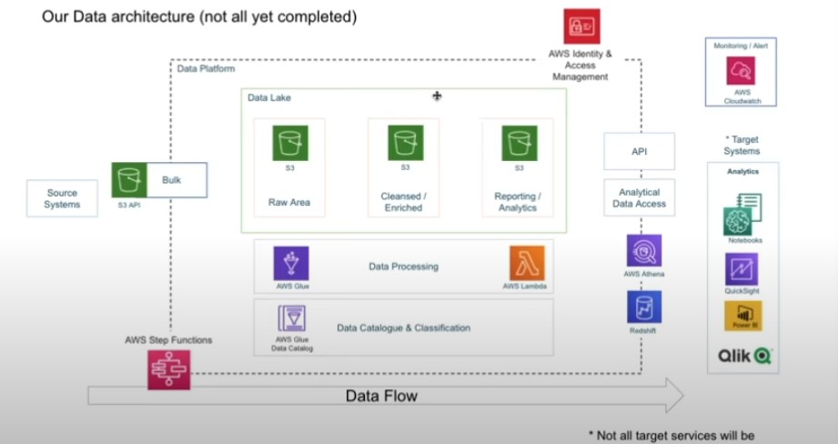
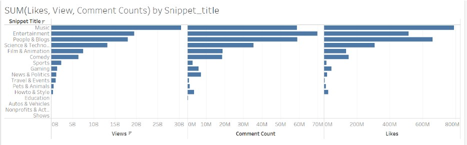

# Data-Engineering-Project-001-Youtube-Ad-Campaign-End-to-End-Project

Project Name - Youtube Ad Campaign End-to-End Project

Project Requirements

We have a client that wants to run new ad campaigns online and they have selected their main advertising channel as youtube. They want to understand some of the initial questions that they have, such as: how to categorize videos based on comments and stylistics and what factors affect how popular a youtube video will be. These are the things they want to understand before actually investing money in the youtube campaign. 

Project Goals

We have data ingestion so we will have data coming from multiple sources then we will design an ETL pipeline to extract transform and load our data easily. We will also build a data lake so that we can easily organize our data and build a data pipeline around it. It should be scalable. So, we will be using AWS Cloud. In the end, we will build a dashboard to easily visualize and understand what is happening in the data. 

## Generation Layer 

Step 1: The data set is Kaggle - Trending YouTube Video Statistics dataset found on https://www.kaggle.com/datasets/datasnaek/youtube-new. Downloaded the dataset with consists of JSON files and CSV files to your local machine.

Data Lake

S3 buckets - Raw - Cleansed - Reporting

Raw 
loaded thru S3 API Csv files
loaded thru S3 API Json files

Cleansed
CSV file to Parquet via Glue Spark job
Json files to parquet via Lambda function attached to S3 Trigger

Reporting
Created a reporting layer which is a join of the two cleansed tables

Data Analytics

Tableau Dashboard
By connections Tableau to Athena to access the reporting layer 

<u>Next Steps</u>

* Sentiment analysis in a variety of forms
* Categorising YouTube videos based on their comments and statistics.
* Training ML algorithms like RNNs to generate their own YouTube comments.
* Analysing what factors affect how popular a YouTube video will be.
* Statistical analysis over time